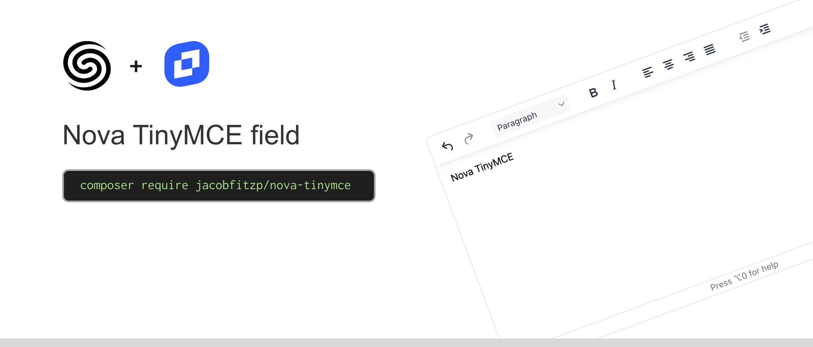

<a href="https://codeclimate.com/github/JacobFitzp/nova-tinymce/maintainability"></a>

## Features

- 🔧 Fully configurable
- 🌄 Image uploads
- 🎨 Light and dark mode

## Prerequisites

- Laravel >= 11
- PHP >= 8.0
- Laravel Nova >= 4
- TinyMCE API Key [(get one here)](https://www.tiny.cloud/auth/signup/)

## Installation

You can install the package via composer:

```shell
composer require jacobfitzp/nova-tinymce
```

## Usage

Before you start using the TinyMCE field you need to set your API key, the easiest way to do this is by 
setting `TINYMCE_API_KEY` environment variable. Alternatively you can publish the configuration file and set it there.

Now you can simply use the `Tinymce` field in your Nova resource:

```php
Tinymce::make('Content')
    ->fullWidth(),
```

## Configuration

Publish the configuration file:

```shell
php artisan vendor:publish --tag=nova-tinymce
```

### Plugins

By default, a set of the most commonly used free plugins are enabled, you can change this to suit your needs by configuring
the `plugins` array.

[More information here.](https://www.tiny.cloud/docs/tinymce/latest/plugins/)

### Toolbar

By default, the toolbar is generated by TinyMCE. But you can easily customize it with the `toolbar` config.

[More information here.](https://www.tiny.cloud/docs/tinymce/latest/toolbar-configuration-options/)

### Image uploads

Image uploads should work out of the box with Nova's default storage disk, while this is enough for most cases you can 
easily configure or even replace the server-side implementation.

#### storage_disk

The disk you want to use for image storage, if not provided then it falls back to Nova's default disk (`nova.storage_disk`).

#### storage_path

The path you want to store uploaded images in, by default its `./nova-tinymce`.

#### storage_max

The maximum allowed filesize in kilobytes, defaults to 20,000 (20MB).

#### storage_endpoint

Relative path to the API endpoint responsible for handling image uploads, generally you
shouldn't need to touch this as one is provided, but if you have very specific requirements you can override it with your
own endpoint.

The endpoint needs to accept a POST request with a file (`file`), and respond a URL to the uploaded image in the following
format:
```json
{ "location": "https://example-cdn.com/nova-tintmce/my-image.jpg" }
```

### Everything else

For most other things you can pass configuration options directly to the editor component via the `init` configuration property.

[More information here.](https://www.tiny.cloud/docs/tinymce/latest/initial-configuration/)

## License

The MIT License (MIT). Please see License File for more information.
